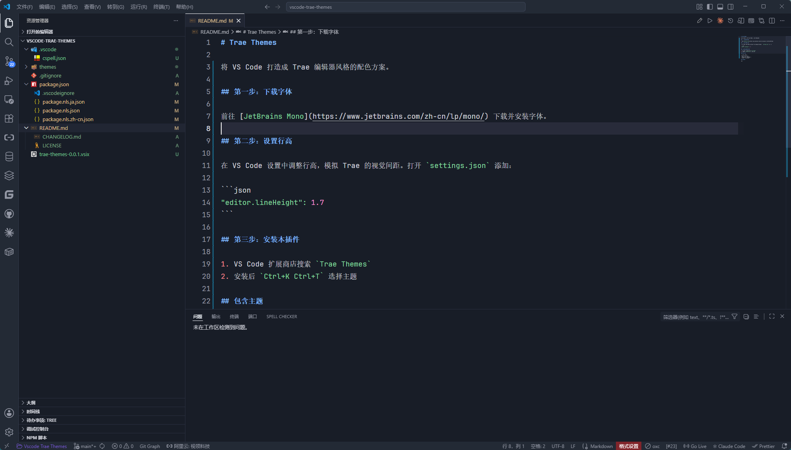
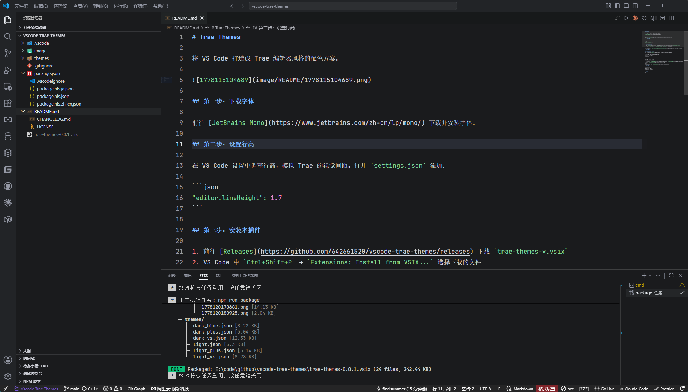
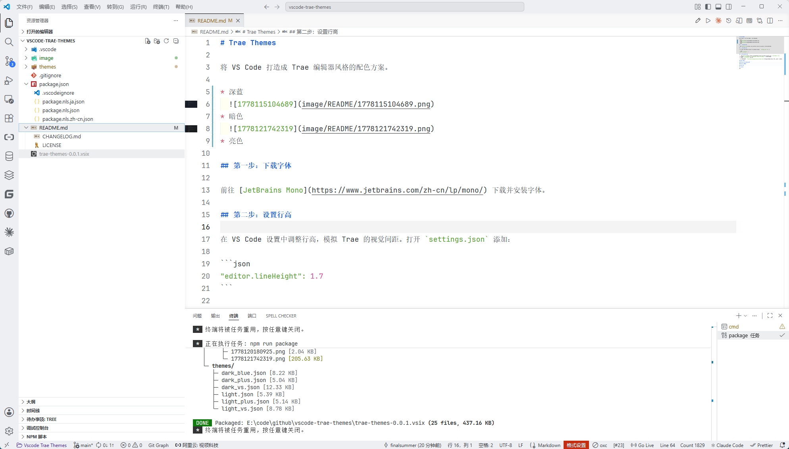
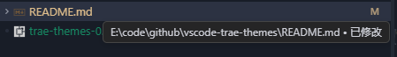
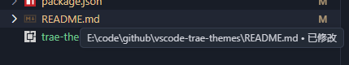
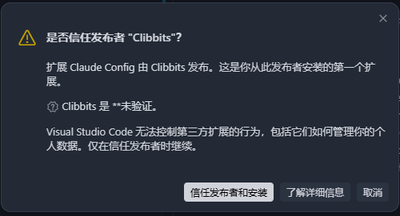
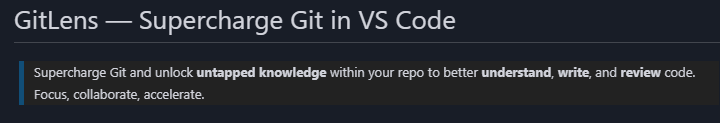
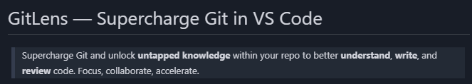

# Trae Themes

将 VS Code 打造成 Trae 编辑器风格的配色方案，包含三个主题。

| 主题 | 预览 |
|------|------|
| Deep Blue（深蓝） |  |
| Dark（暗色） |  |
| Light（亮色） |  |

> 本插件源码来源于 `Trae\resources\app\extensions\theme-icube`，主要修复了深蓝（Deep Blue）配色问题。暗色（Dark）保持原版未改动。

## 安装步骤

### 第一步：下载字体

前往 [JetBrains Mono](https://www.jetbrains.com/zh-cn/lp/mono/) 下载并安装字体。

### 第二步：设置行高

在 VS Code 设置中调整行高，模拟 Trae 的视觉间距。打开 `settings.json` 添加：

```json
"editor.lineHeight": 1.7
```

### 第三步：安装本插件

1. 前往 [Releases](https://github.com/642661520/vscode-trae-themes/releases) 下载 `trae-themes-*.vsix`
2. VS Code 中 `Ctrl+Shift+P` → `Extensions: Install from VSIX...` 选择下载的文件
3. 安装后 `Ctrl+K Ctrl+T` 选择主题

## 深蓝配色修复

> 以下修复仅针对 Deep Blue（深蓝）主题。

### Trae 与 VS Code 不兼容

Trae 使用了自有的 `icube.*` 颜色变量，VS Code 无法识别，导致 UI 区域颜色丢失。

- 状态栏背景透明
- 侧栏 / 面板 / 分栏之间的边框分割线缺失
- 输入框边框
- 扩展安装按钮

### Trae 原版遗漏

| 修复项 | 修复前 | 修复后 |
|--------|--------|--------|
| 选项卡 |  |  |
| 鼠标移入提示 |  |  |
| 弹窗 | |  |
| MD 代码块 / 引用块背景 |  |  |
| 终端固定区悬停 | — |  |

## 亮色修复

- 状态栏文字不可见 → 背景 `#EDEFF2`，文字 `#31353A`

## 二次开发

```bash
git clone https://github.com/642661520/vscode-trae-themes.git
cd vscode-trae-themes
# 编辑 themes/ 下的主题 JSON 文件，修改颜色
npm run package
# 生成 trae-themes-0.0.2.vsix，即可安装测试
```

## License

MIT
